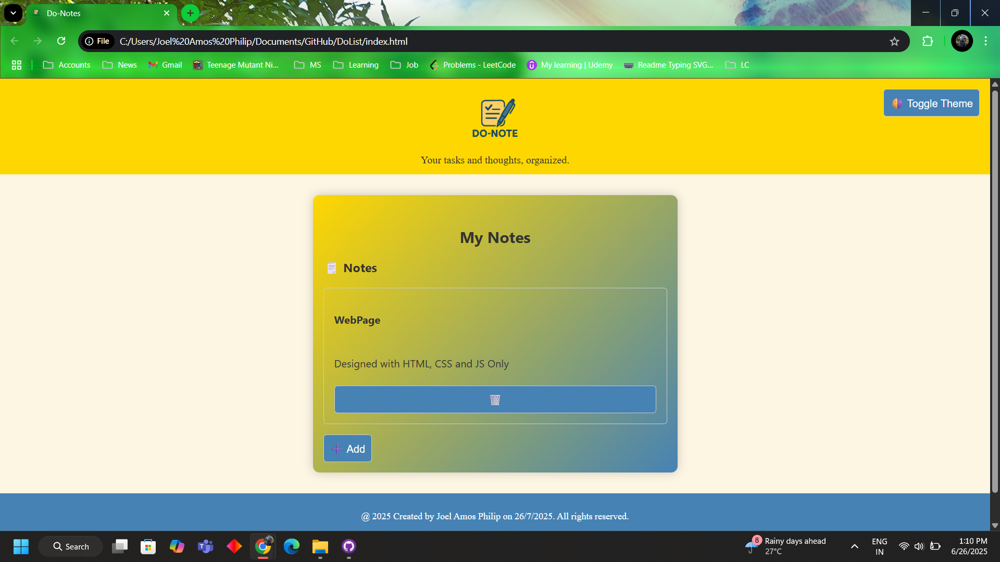
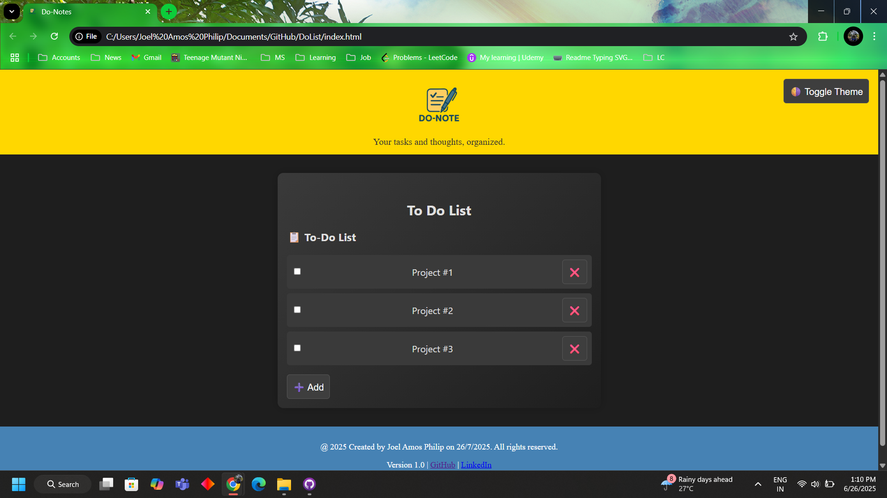

<h1>
  
  Do-Note
</h1>

**Do-Note** is a thoughtfully designed web application that combines the functionality of a **Notes App** and a **To-Do List Manager** — all in a single, beautifully styled interface. It allows you to capture your ideas, write quick thoughts, and organize your actionable tasks in one place, with zero distractions.

Whether you're planning your day, managing a project, or jotting down creative sparks, Do-Note offers a seamless space to both **think and execute**.  
Perfect for students, solo developers, creatives, or anyone who wants **both planning and journaling in one unified dashboard**.

---

<h2>🖼️ Screenshots</h2>

  
  

## 📖 Story of Creation

Like most developers, I had **a mind full of project ideas**, scattered across my phone’s to-do list app. When I was figuring out which one to build first, a new idea struck me:

> “Why not start by building a to-do list app myself and use that to organize the rest?”

It seemed like the perfect launchpad — but as I began planning, I realized: the web is already **flooded with countless To-Do List projects**. It felt too repetitive, too obvious.

So I paused and thought — *how could I make this more personal and unique?*

That’s when the idea evolved.

Instead of making just another checklist tool, I decided to **combine two powerful productivity tools — a To-Do List and a Notes App** — into one page, **with shared styling, interaction, and purpose**. That gave birth to the idea of **Do-Note** — short for *“Do” (your tasks) + “Note” (your thoughts)*.

This project was built as part of my **Frontend Development course on Udemy**, and it helped me apply every concept I learned in a meaningful way.

---

## 🚀 Features

- 🌗 **Theme Toggle** – Light and dark modes on click
- 🗒️ **Notes Section** – Add, view, color-tag, and edit notes
- ✅ **To-Do List** – Add task titles, blur for focus, and toggle visibility
- 🔁 **View Toggle** – Switch between "My Notes" and "To-Do List" instantly
- 🖼️ **Logo and Favicon** – Personalized branding with `logo.png`
- 🌀 **Clean UI** – Yellow-steel blue gradient for a calming, productive vibe
- 📱 **Responsive Design** – Optimized for screens of all sizes

---

## 🛠️ Built With

- **HTML5** – Semantic layout and structure
- **CSS3** – Flexbox, gradients, transitions, and responsive design
- **Vanilla JavaScript** – DOM manipulation, event handling, theme and mode switching

---

## ⏳ Development Timeline

> Project completed in **3 days**:

| Day | Task |
|-----|------|
| 1 | HTML structure, layout design, header/footer setup |
| 2 | Notes + Tasks sections with mode toggle |
| 3 | Theme switching, blur/unblur, edit/cancel flow, and styling polish |

---

## 🔮 Future Scope

What’s coming next:

- 💾 **Local storage or database** support for persistent data
- 🔐 **Authentication/Login** for multi-device access
- 📱 **Mobile-first redesign** for smaller screens
- 🏷️ **Categories or tags** for notes and tasks
- 🔔 **Reminders/notifications** integration
- ⏰ **Due date and sorting** features

> Feel free to fork, remix, or use this project as inspiration for your own productivity app!
